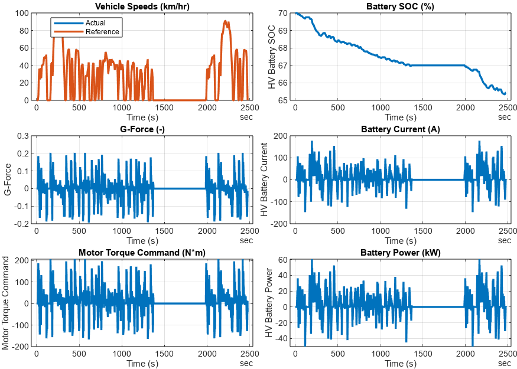

# <span style="color:rgb(213,80,0)">BEV System Model - Simulation Case</span>
```matlab
modelName = "BEV_system_model";
load_system(modelName)
BEV_useComponents_Basic
```

```TextOutput
Use Basic models for all components.
```

```matlab
VehSpdRef_loadCase_FTP75( ...
  ModelName = modelName, ...
  TargetSubsystemPath = ...
    "/Controller & Environment" + ...
    "/Vehicle speed reference" )
```

```TextOutput
Setting up simulation...
Simulation case: FTP-75 using Drive Cycle Source block
Setting simulation stop time to 2474 sec.
Selecting simulation case 3.
```

```matlab
simOut = sim(modelName);
simData = extractTimetable(simOut.logsout);
fig = BEV_plotResultsCompact( SimData = simData, PlotTemperature = false );
```

<center></center>


*Copyright 2023 The MathWorks, Inc.*

