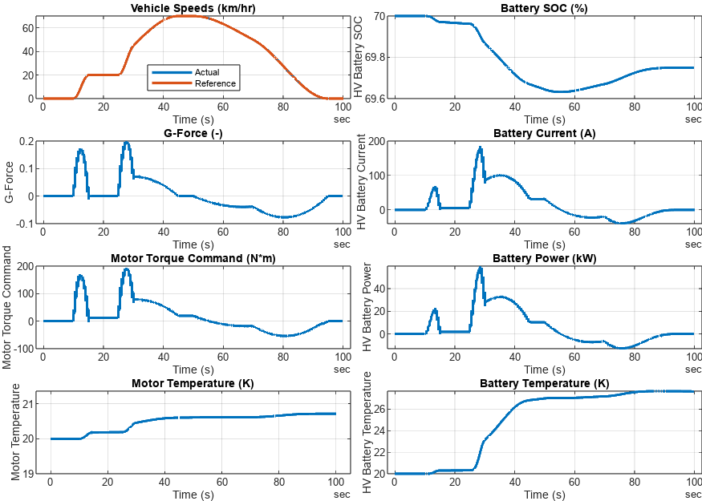

# <span style="color:rgb(213,80,0)">BEV System Model - Simulation Case</span>
```matlab
modelName = "BEV_system_model";
load_system(modelName)
% Use thermal-model-enabled components.
BEV_useComponents_Thermal
```

```TextOutput
Use thermal models for Motor Drive Unit and High Voltage Battery components.
```

```matlab
VehSpdRef_loadCase_SimpleDrivePattern( ...
  ModelName = modelName, ...
  TargetSubsystemPath = ...
    "/Controller & Environment" + ...
    "/Vehicle speed reference" )
```

```TextOutput
Setting up simulation...
Simulation case: Simple drive pattern
Setting simulation stop time to 100 sec.
Selecting simulation case 1.
```

```matlab
simOut = sim(modelName);
simData = extractTimetable(simOut.logsout);
fig = BEV_plotResultsCompact( SimData = simData );
```

<center></center>


*Copyright 2023 The MathWorks, Inc.*

