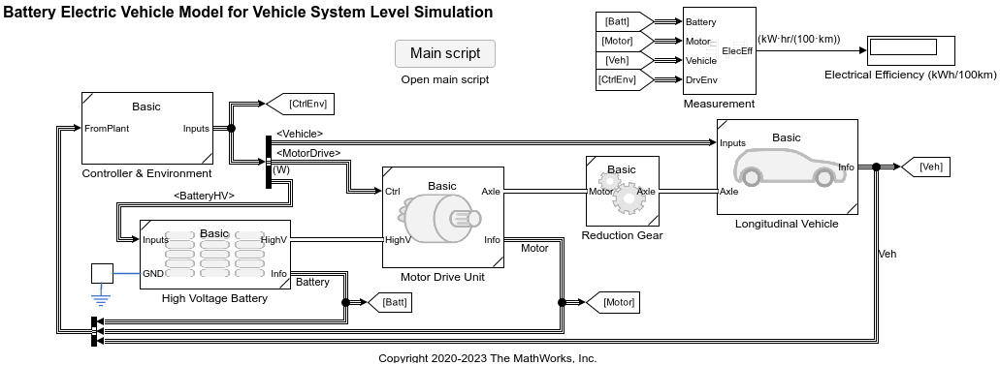
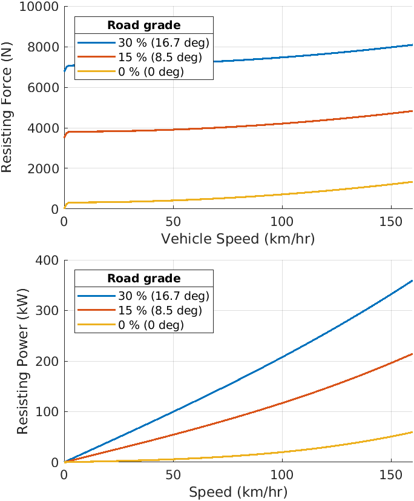

# Battery Electric Vehicle Model in Simscape

Open the Project by double\-clicking **<samp>BatteryElectricVehicle.prj</samp>** file if you have not opened the project yet. It will load shortcuts to scripts and models in **Project Shortcuts** in Toolstrip.

# Battery Electric Vehicle (BEV) Model for System Level Simulation

This is a simple, fast running BEV model which can estimate the electrical efficiency of the vehicle. It is also suitable for further customizations for more focused analysis of individual components at vehicle system level.

Open the [BEV system model](matlab:openFile('BEV_system_model')). You can also use the shortcut button **BEV system model** in the **Project Shortcuts** toolstrip.

Files related to the BEV system model can be found at **BEV** folder.

# Vehicle Components
## Longitudinal Vehicle

Longitudinal abstract vehicle model can be used to find required powertrain performance (such as motor torque and power etc.) given basic vehicle performance specifications.

Open the [Vehicle 1D harness model](matlab:openFile('Vehicle1D_harness_model')). You can also use the shorcut button **Vehicle1D** in the **Project Shortcuts** toolstrip to open harness model. You can simulate and analyse basic vehicle performance with the Vehicle1D harness model.

See **README.md** in the **Components > Vehicle1D** folder for more informaton.

## High Voltage Battery Pack

Four different abstract models are available as a high voltage battery pack component.

-  **Basic** model simulates voltage and current. 
-  **Simple system** model simulates voltage, current, and temperature using equation\-based model. 
-  **System** model simulates voltage, current, temperature as well as charing dynamics, fading, and aging using equation\-based model. 
-  **Table\-based system** model simulates the same quantities as System model, but uses table data for terminal voltage and resistance. 

Open the [Battery HV harness model](matlab:openFile('BatteryHV_harness_model')). You can also use the shortcut button **High Voltage Battery** in the **Project Shortcuts** toolstrip to open harness model.

See **README.md** in the **Components > BatteryHighVoltage** folder for more informaton.

## Motor Drive Unit

Four different abstract models are available as a motor drive unit component.

-  **Basic** model simulates the high level behavior of power conversion between electrical and mechanical powers using abstract copper loss model. 
-  **Basic thermal** model is similar to Basic model, but this model considers temperature dynamics too. 
-  **System\-level** model is similar to the above models, but this model considers irons loss and constant/fixed loss too. 
-   **System\-level model with tabulated losses** is similar to the above models, but this model uses tabulated data for power conversion efficiency or losses. 

Click the shortcut button **Motor Drive Unit** in the **Project Shortcuts** toolstrip to open harness model.

See **README.md** in the **Components > MotorDriveUnit** folder for more informaton including **single efficiency measurement model** used in Basic, Basic thermal, and System\-level models for electro\-mechanical power conversion.

## Other components

In addition to the above components, other components such as **Vehicle Speed Reference** component are stored in the **Components** folder too.

# Detailed Model Application

This project includes detailed model applications for permanent magnet synchronous motor (PMSM). See the **DetailedModelApplications > MotorDrivePmsmFem** folder for more information.

# About this project

For additional information about this project, see **About BEV Project** live script in the **Utility** folder.

*Copyright 2020\-2023 The MathWorks, Inc.*

