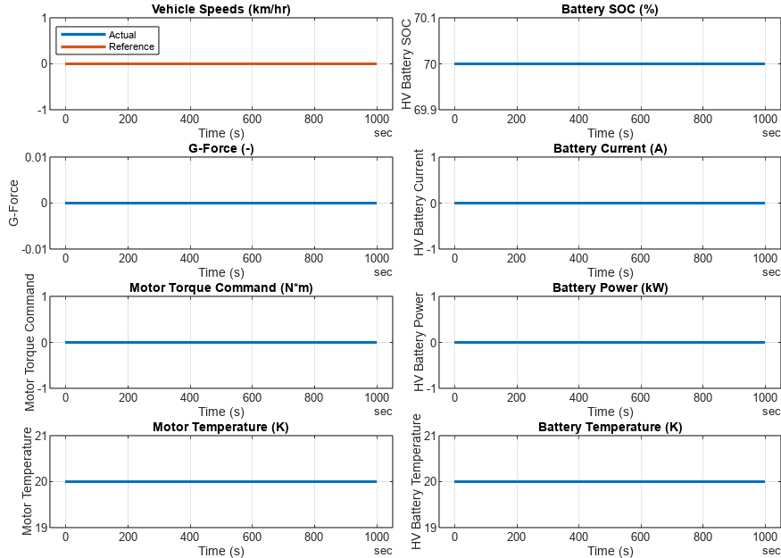

# <span style="color:rgb(213,80,0)">BEV System Model \- Simulation Case</span>
```matlab
modelName = "BEV_system_model";
load_system(modelName)
% Use thermal-model-enabled components.
BEV_useComponents_Thermal
```

```matlabTextOutput
Use thermal models for Motor Drive Unit and High Voltage Battery components.
Warning: BatteryHV_refsub_SystemSimple (systems/system_root.xml, line 342): Simulink.DataType object 'Bus_HighVoltage' is not in scope from 'BatteryHV_refsub_SystemSimple/Simscape Bus'
```

```matlab
VehSpdRef_loadCase_Constant( ...
  ModelName = modelName, ...
  TargetSubsystemPath = ...
    "/Controller & Environment" + ...
    "/Vehicle speed reference" )
```

```matlabTextOutput
Setting up simulation...
Simulation case: Constant
Setting simulation stop time to 1000 sec.
Selecting simulation case 5.
```

```matlab
simOut = sim(modelName);
simData = extractTimetable(simOut.logsout);
fig = BEV_plotResultsCompact( SimData = simData );
```

<center></center>


*Copyright 2023 The MathWorks, Inc.*

