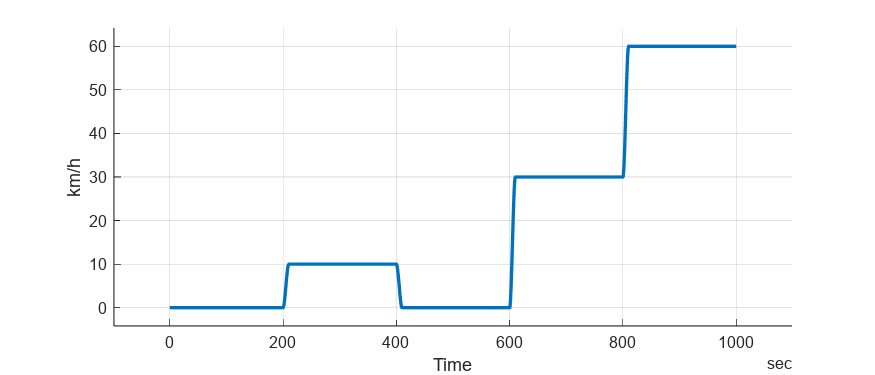
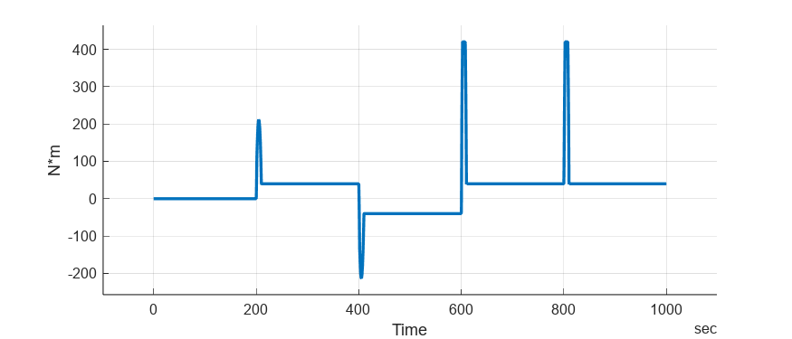

# <span style="color:rgb(213,80,0)">BEV Controller - Simulation Case</span>
```matlab
mdl = "BEVController_harness_model";
if not(bdIsLoaded(mdl))
  load_system(mdl) 
end
BEVController_harness_setup
simOut = sim(mdl);
simData = extractTimetable(simOut.logsout);
sigName = "Vehicle speed input kph";
fig = figure; hold on; grid on; axis padded
fig.Position(3:4) = [700 300];
plot(simData, "Time", sigName, LineWidth=2)
ylabel("km/h")
```

<center></center>


```matlab
sigName = "Motor torque command";
fig = figure; hold on; grid on; axis padded
fig.Position(3:4) = [700 300];
plot(simData, "Time", sigName, LineWidth=2)
ylabel("N*m")
```

<center></center>


*Copyright 2023 The MathWorks, Inc.*

