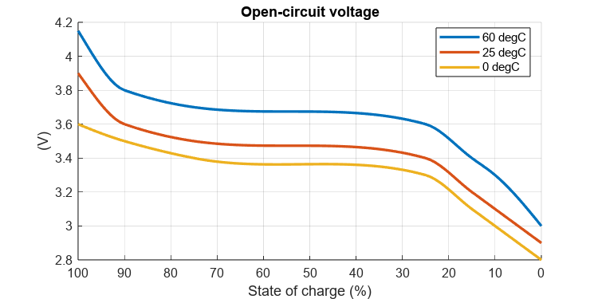
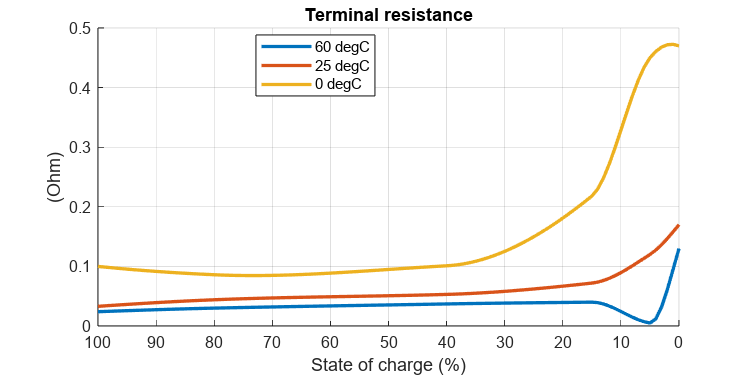

# <span style="color:rgb(213,80,0)">Building model parameters for table-based battery block</span>

Table-based battery block has parameters for open-circuit volatge (OCV) and terminal resistance as a function of temeprature and the state of charge (SOC).


This script shows how to generate data for these parameters from small number of data points. This technique is used in parameter files too.

# Open-circuit voltage
```matlab
% Example data points at 60, 25, 0 degC.
% First column is SOC (%). Second column is OCV (V).
BatteryHV_buildOpenCircuitVoltageData( ...
   0, [ 0 2.8; 10 3.0; 15 3.1; 25 3.3; 75 3.4; 90 3.5; 100 3.6 ], ...
  25, [ 0 2.9; 10 3.1; 15 3.2; 25 3.4; 75 3.5; 90 3.6; 100 3.9 ], ...
  60, [ 0 3.0; 10 3.3; 15 3.4; 25 3.6; 75 3.7; 90 3.8; 100 4.15 ], ...
  MakePlot = true );
```

<center></center>

# Terminal resistance
```matlab
% Example data points at 60, 25, 0 degC.
% First column is SOC (%). Second column is Terminal resistance R0 (Ohm).
BatteryHV_buildTerminalResistanceData( ...
   0, [ 0 0.47 ; 5 0.45  ; 15 0.218 ; 40 0.101 ; 80 0.086 ; 100 0.1   ], ...
  25, [ 0 0.17 ; 5 0.12  ; 15 0.072 ; 40 0.053 ; 80 0.044 ; 100 0.033 ], ...
  60, [ 0 0.13 ; 5 0.005 ; 15 0.04  ; 40 0.037 ; 80 0.03  ; 100 0.024 ], ...
  MakePlot = true );
```

<center></center>


*Copyright 2023 The MathWorks, Inc.*

