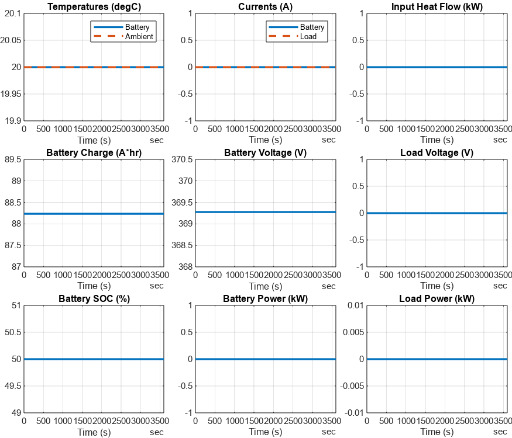

<a name="T_1FFD3858"></a>
# <span style="color:rgb(213,80,0)">High Voltage Battery - Simulation Case</span>
<a name="H_1B376934"></a>
# Constant inputs

Use this to check that simulation runs ok.

```matlab
mdl = "BatteryHV_harness_model";
load_system(mdl)

% Load model parameters.
BatteryHV_harness_setup

% Select battery model.
% BatteryHV_useRefsub_Basic
BatteryHV_useRefsub_SystemTable
```

```TextOutput
Model: BatteryHV_harness_model
Setting up referenced subsystem: BatteryHV_refsub_SystemTable
```

```matlab
% Setup simulation case.
BatteryHV_loadSimulationCase_Constant
```

```TextOutput
Setting up simulation...
Simulation case: Constant inputs
Setting simulation stop time to 1000 sec.
Setting block parameters for input blocks...
Setting initial conditions...
initial.hvBattery_SOC_pct = 50
initial.hvBattery_SOC_normalized = 0.5
initial.hvBattery_Charge_Ahr = 88.2353
initial.hvBattery_Temperature_K = 293.15
initial.ambientTemp_K = 293.15
```

```matlab
set_param(mdl, StopTime="3600")
% Run simulation.
simOut = sim(mdl);

% Collect logged signals and visualize.
% The basic version of the battery block does not simulate battery temperature.
logged_signals = extractTimetable(simOut.logsout);
BatteryHV_plotResults(logged_signals);
```

<center></center>


*Copyright 2020-2023 The Mathworks, Inc.*

