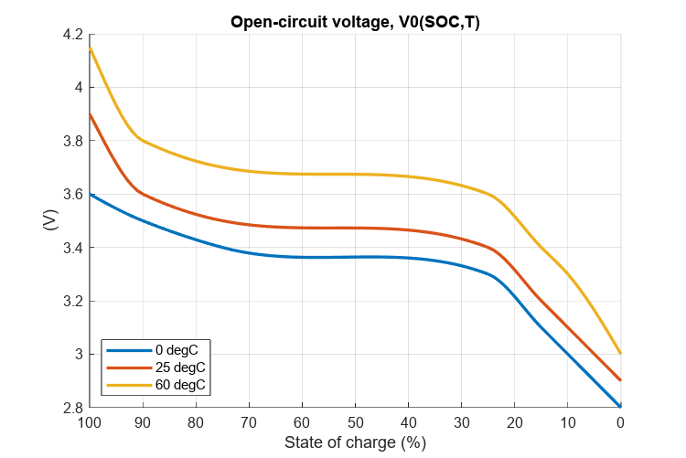
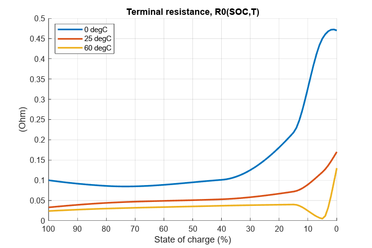

# <span style="color:rgb(213,80,0)">Table\-Based Battery block</span>

This script collects the open\-circuit voltage and terminal voltage parameters of table\-based battery block in model file and makes the plots of the parameters.

```matlab
% Model to collect parameter values.
mdl = "BatteryHV_refsub_SystemTable";
% Block path to the target battery block.
blkpath = "/Battery/Battery (Table-Based)";
```

Collect parameter values from the battery block in the model.

```matlab
fullblkpath = mdl + blkpath;
BatteryHV_harness_setup
load_system(mdl)

% State of charge ... independent variable 1
SOC_normalized = eval(get_param(fullblkpath, "SOC_vec"))';
SOC_pct = SOC_normalized * 100;

% Battery temperature ... independent variable 2
T_vec = eval(get_param(fullblkpath, "T_vec"));
T_vec_unit = get_param(fullblkpath, "T_vec_unit");
TemperatureStr = "" + eval(get_param(fullblkpath, "T_vec")) + " " + T_vec_unit
```

```matlabTextOutput
TemperatureStr = 1x3 string    
"0 degC"     "25 degC"    "60 degC"    

```

```matlab

% Open-circuit voltage, V0(SOC,T)
V0_mat = eval(get_param(fullblkpath, "V0_mat"))
```

```matlabTextOutput
V0_mat = 101x3    
    2.8000    2.9000    3.0000
    2.8200    2.9200    3.0338
    2.8400    2.9400    3.0672
    2.8600    2.9600    3.1001
    2.8800    2.9800    3.1322
    2.9000    3.0000    3.1635
    2.9200    3.0200    3.1937
    2.9400    3.0400    3.2226
    2.9600    3.0600    3.2501
    2.9800    3.0800    3.2760

```

```matlab
V0_mat_unit = get_param(fullblkpath, "V0_mat_unit")
```

```matlabTextOutput
V0_mat_unit = 'V'
```

```matlab

% Terminal resistance, R0(SOC,T)
R0_mat = eval(get_param(fullblkpath, "R0_mat"))
```

```matlabTextOutput
R0_mat = 101x3    
    0.4700    0.1700    0.1300
    0.4726    0.1582    0.0955
    0.4719    0.1469    0.0614
    0.4679    0.1364    0.0320
    0.4606    0.1273    0.0118
    0.4500    0.1200    0.0050
    0.4342    0.1137    0.0071
    0.4126    0.1074    0.0105
    0.3867    0.1011    0.0147
    0.3582    0.0951    0.0195

```

```matlab
R0_mat_unit = get_param(fullblkpath, "R0_mat_unit")
```

```matlabTextOutput
R0_mat_unit = 'Ohm'
```
# Open\-ciruit voltage
```matlab
fig = figure;
fig.Position(3:4) = [600 400];
hold on
grid on
for idx = 1 : numel(T_vec)
  plot(SOC_pct, V0_mat(:,idx), LineWidth=2)
end
set(gca, xdir = "reverse")
legend(TemperatureStr, Location="southwest")
xlabel("State of charge (%)")
ylabel("(" + V0_mat_unit + ")")
title("Open-circuit voltage, V0(SOC,T)")
```

<center></center>

# Terminal resistance
```matlab
fig = figure;
fig.Position(3:4) = [600 400];
hold on
grid on
for idx = 1 : numel(T_vec)
  plot(SOC_pct, R0_mat(:,idx), LineWidth=2)
end
set(gca, xdir = "reverse")
legend(TemperatureStr, Location="best")
xlabel("State of charge (%)")
ylabel("(" + R0_mat_unit + ")")
title("Terminal resistance, R0(SOC,T)")
```

<center></center>


*Copyright 2023 The MathWorks, Inc.*

