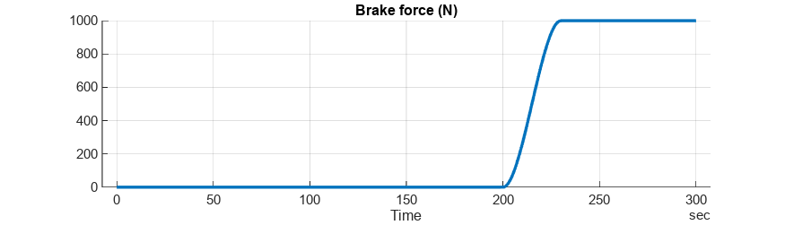
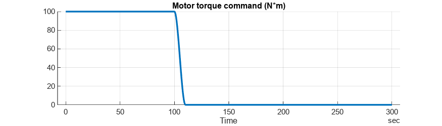
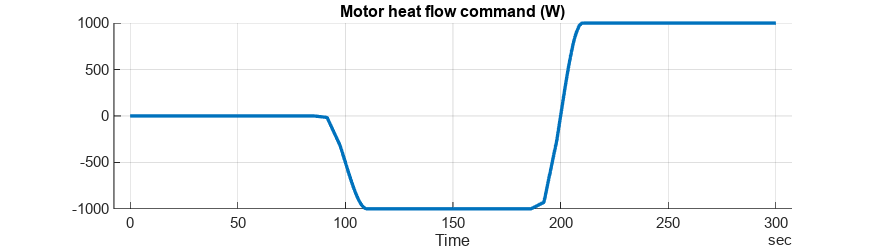
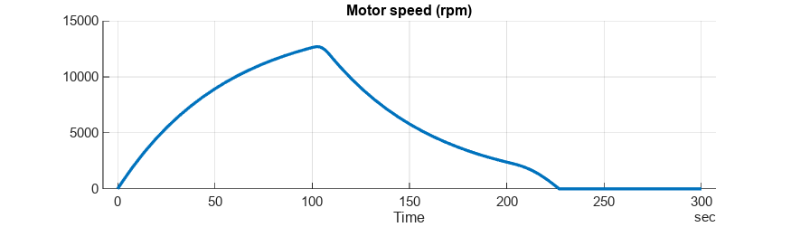
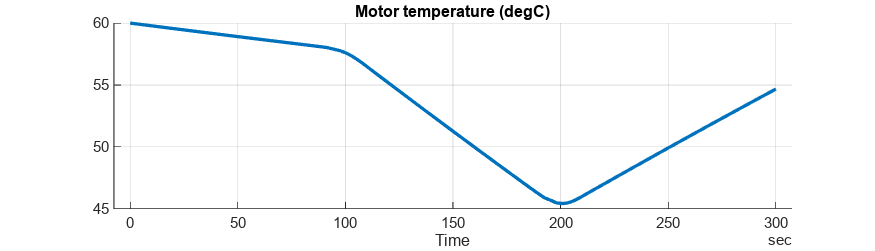
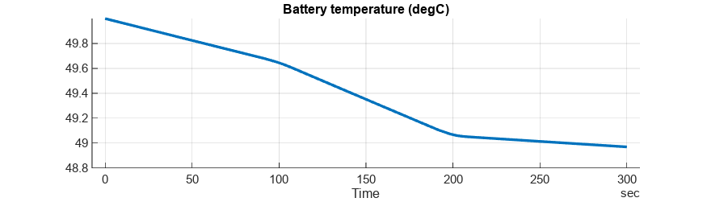

# <span style="color:rgb(213,80,0)">Simplistic Vehicle - Simulation Case</span>

Note that vehicle dynamics and temperature dynamics are isolated from each other in the model, and it is intentional.

```matlab
mdl = "CtrlEnv_Vehicle_harness_model";
if not(bdIsLoaded(mdl))
  load_system(mdl)
end
CtrlEnv_Vehicle_harness_setup

CtrlEnv_Vehicle_loadSimulationCase
```

```TextOutput
Setting up simulation...
Simulation case: Default
Setting simulation stop time to 300 sec.
Setting block parameters...
Setting initial conditions...
initial.VehicleSpeed_kph = 0
initial.VehicleInertiaSpd_rpm = 0
initial.MotorTemperature_K = 333.15
initial.MotorAmbientTemperature_K = 293.15
initial.BatteryTemperature_K = 323.15
initial.BatteryAmbientTemperature_K = 293.15
```

```matlab

simOut = sim(mdl);
simData = extractTimetable(simOut.logsout);

CtrlEnv_Vehicle_plotResults( ...
  SimData = simData, ...
  FigureHeight = 200 );
```

<center></center>


<center></center>


<center></center>


<center></center>


<center></center>


<center></center>


<center></center>


<center></center>


*Copyright 2023 The MathWorks, Inc.*

