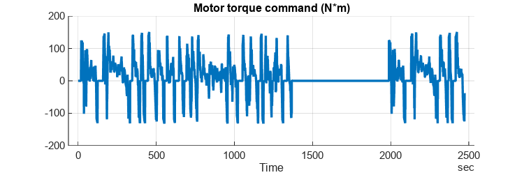
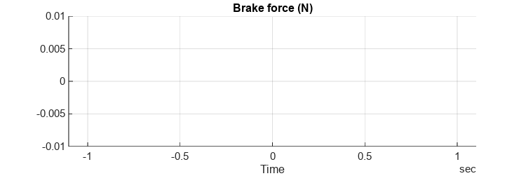
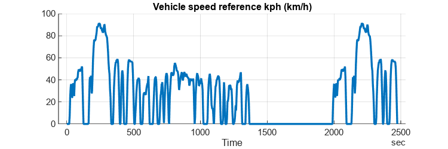
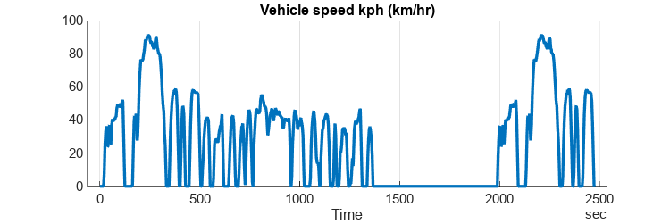
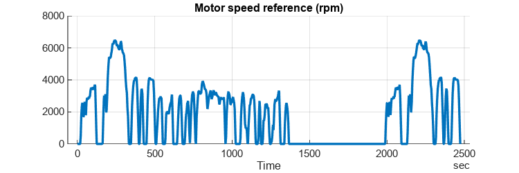
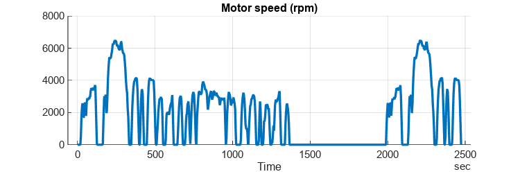
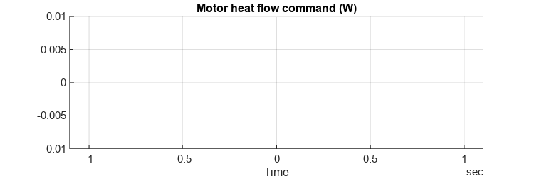
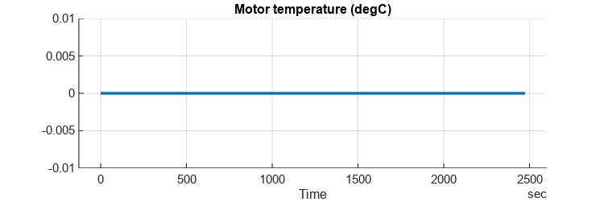
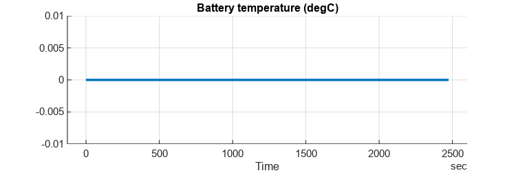

# <span style="color:rgb(213,80,0)">Controller and Environment \- Simulation Case</span>
```matlab
mdl = "CtrlEnv_harness_model";
if not(bdIsLoaded(mdl)) 
  load_system(mdl)
end
CtrlEnv_harness_setup
CtrlEnv_loadCase_FTP75
```

```matlabTextOutput
Setting up simulation...
Simulation case: FTP-75 using Drive Cycle Source block
Setting simulation stop time to 2474 sec.
Selecting simulation case 3.
```

```matlab
simOut = sim(mdl);
```

```matlab
simData = extractTimetable(simOut.logsout);
CtrlEnv_plotResults( SimData = simData, ...
  FigureHeight = 200 );
```

<center></center>


<center></center>


<center></center>


<center></center>


<center></center>


<center></center>


<center></center>


<center></center>


<center></center>


<center></center>


*Copyright 2023 The MathWorks, Inc.*

