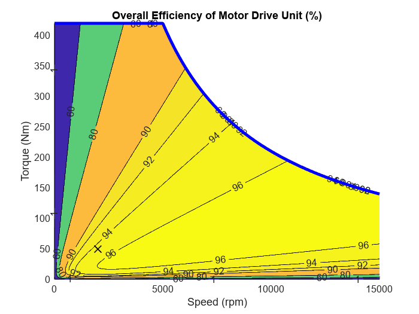

# <span style="color:rgb(213,80,0)">Efficiency Map of Motor Drive Unit</span>

This script collects block parameters from the System-level model of Motor Drive Unit component and makes a plot motor efficiency contour map.

# System-level model
```matlab
mdl = "MotorDriveUnit_refsub_System";
MotorDriveUnit_refsub_System_params
load_system(mdl)
blkpath = mdl + "/Motor Drive/Motor & Drive (System Level)";
info = MotorDriveUnit_getBlockInfo_System(blkpath)
```

```TextOutput
info = 
                   MaxTorque_Nm: 420
                    MaxPower_kW: 220
                 ResponseTime_s: 0.0200
                 Efficiency_pct: 95
             Speed_measured_rpm: 2000
             Torque_measured_Nm: 50
            IronLoss_measured_W: 55
                    FixedLoss_W: 40
             RotorInertia_kg_m2: 5.0000e-04
      RotorDamping_Nm_per_radps: 1.0000e-05
          InitialRotorSpeed_rpm: 0
            ThermalMass_J_per_K: 90000
       Initial_Temperature_degC: 293.1500
    MechanicalPower_measured_kW: 10.4720
         NominalLoss_measured_W: 551.1566
     IronToNominalLossRatio_pct: 9.9790
          CopperLoss_measured_W: 496.1566
```

```matlab
MotorDriveUnit_plotEfficiency( ...
  ... In road vehicle applications,
  ... maximum motor speed is determined by vehicle top speed,
  ... tire rolling radius, and reduction gear ratio. 
  MaxSpeed_rpm = 15000, ...
  ...
  MaxTorque_Nm = info.MaxTorque_Nm, ...
  MaxPower_kW = info.MaxPower_kW, ...
  Efficiency_pct = info.Efficiency_pct, ...
  Speed_measured_rpm = info.Speed_measured_rpm, ...
  Torque_measured_Nm = info.Torque_measured_Nm, ...
  ...
  IronToNominalLossRatio_pct = info.IronToNominalLossRatio_pct, ...
  FixedLoss_W = info.FixedLoss_W, ...
  ...
  RotorDamping_Nm_per_radps = info.RotorDamping_Nm_per_radps, ...
  ...
  ContourLevels_pct = [1 60 80 90 92 94 96 97 98 99], ...
  PlotResolution = 500 );
```

<center></center>


```matlab

%{
FullpathToFolder = fullfile(currentProject().RootFolder, ...
  "Components", "MotorDriveUnit", "Utility", "Images");
imgFilename = mdl + "_efficiency.png"
exportgraphics(gca, fullfile(FullpathToFolder, imgFilename))
%}
```

*Copyright 2021-2023 The MathWorks, Inc.*

