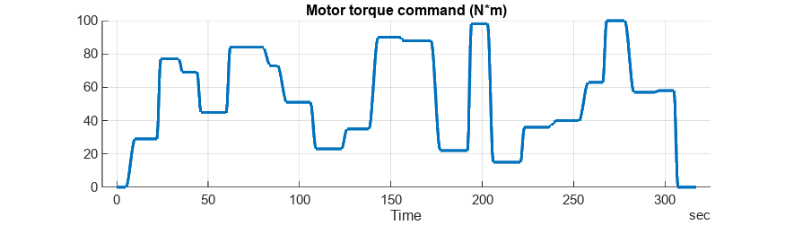
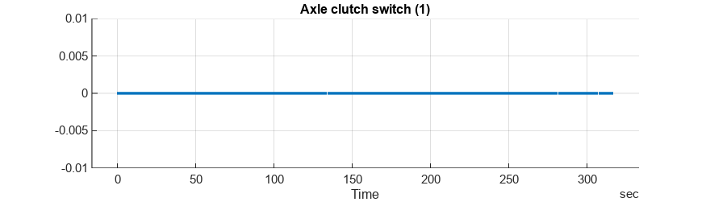
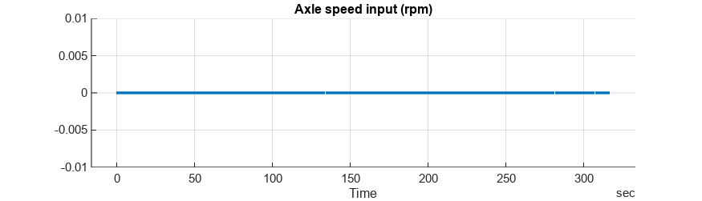
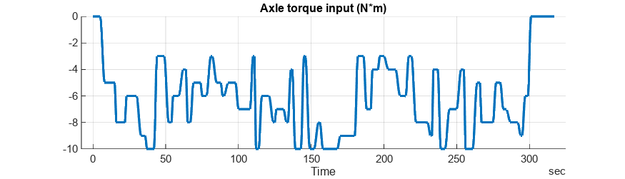
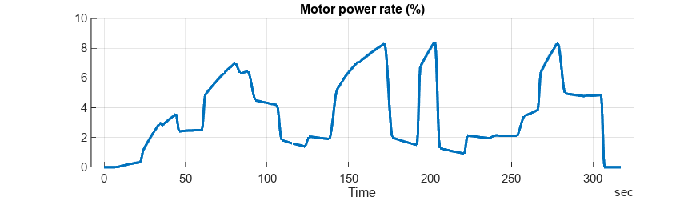
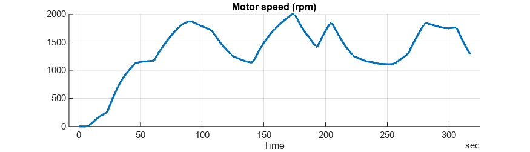
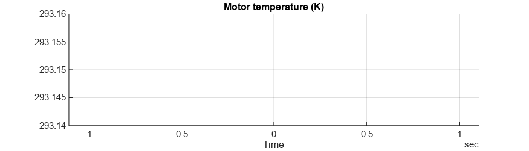
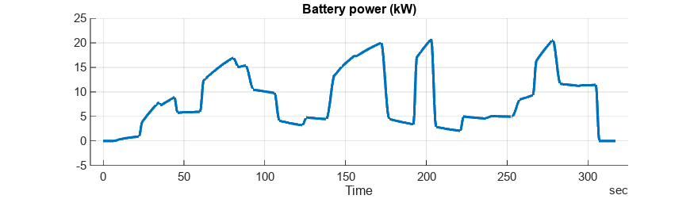
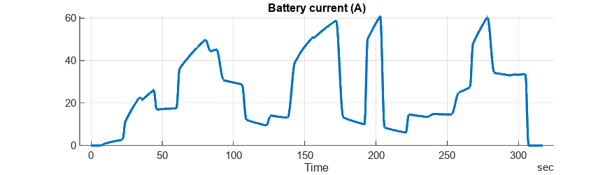
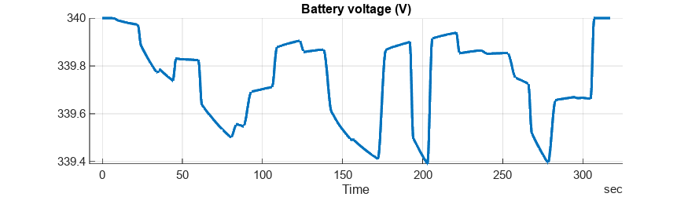

# <span style="color:rgb(213,80,0)">Motor Drive Unit - Simulation Case</span>
# Randomly generated input signals

Test models with arbitrary inputs.

```matlab
mdl = "MotorDriveUnit_harness_model";
if not(bdIsLoaded(mdl))
  load_system(mdl)
end
MotorDriveUnit_harness_setup
```

Select model to use.

```matlab
MotorDriveUnit_useRefsub_Basic
```

```TextOutput
Model: MotorDriveUnit_harness_model
Setting up referenced subsystem: MotorDriveUnit_refsub_Basic
```

```matlab
% MotorDriveUnit_useRefsub_BasicThermal
% MotorDriveUnit_useRefsub_System
% MotorDriveUnit_useRefsub_SystemTable
```

Load simulation case.

```matlab
MotorDriveUnit_loadCase_Random
```

```TextOutput
Setting up simulation...
Simulation case: Randomly generated input signals
Setting simulation stop time to 317 sec.
Setting block parameters...
batteryHV.nominalVoltage_V = 340
batteryHV.internalResistance_Ohm = 0.01
Setting initial conditions...
initial.loadInertiaSpd_rpm = 0
initial.motorSpd_rpm = 0
initial.motorDriveUnit_Temperature_K = 293.15
initial.ambientTemp_K = 293.15
```

Run simulation.

```matlab
simOut = sim(mdl);
```

Visually inspect the result.

```matlab
simData = extractTimetable(simOut.logsout);
sigNames = [
  "Motor torque command"
  "Axle clutch switch"
  "Axle speed input"
  "Axle torque input"
  "Motor power rate"
  "Motor speed"
  "Motor temperature"
  "Battery power"
  "Battery current"
  "Battery voltage"
  ];
for i = 1 : numel(sigNames)
  fig = plotSimulationResultSignal( ...
    SimData = simData, ...
    SignalName = sigNames(i));
  fig.Position(4) = 200;
end
```

<center></center>


<center></center>


<center></center>


<center></center>


<center></center>


<center></center>


<center></center>


<center></center>


<center></center>


<center></center>


*Copyright 2021-2023 The Mathworks, Inc.*

