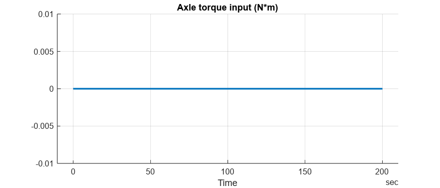
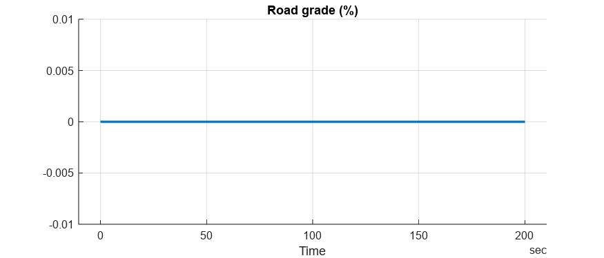
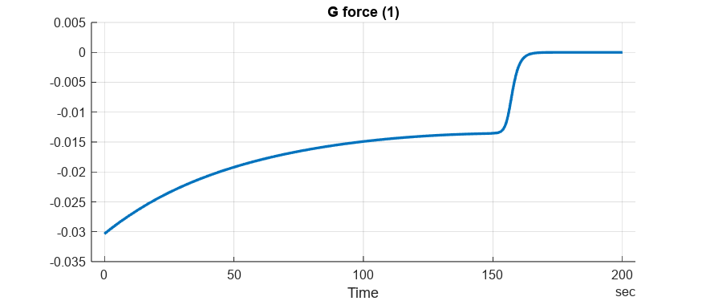
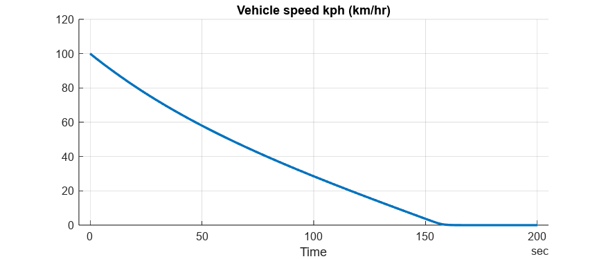
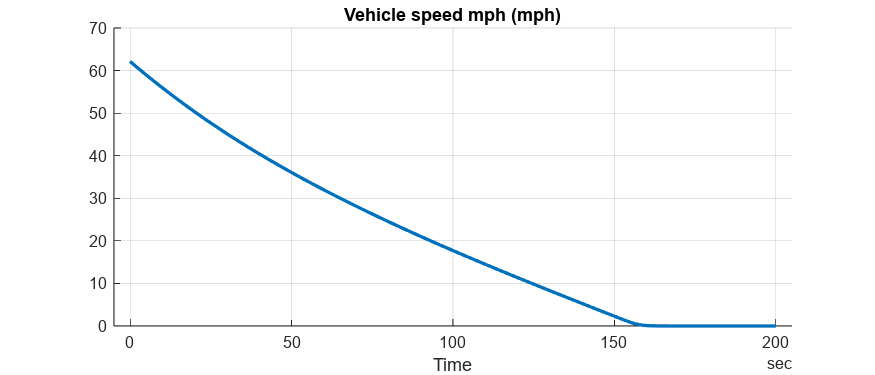
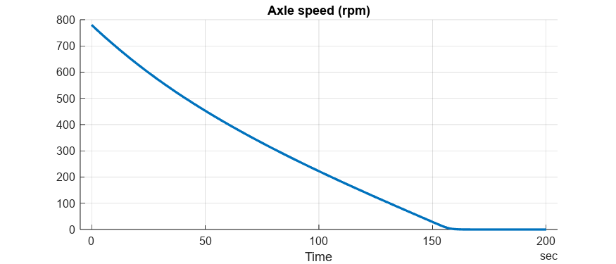

# <span style="color:rgb(213,80,0)">Longitudinal Vehicle \- Simulation Case</span>

# Coastdown
```matlab
mdl = "Vehicle1D_harness_model";
if not(bdIsLoaded(mdl))
  load_system(mdl)
end
Vehicle1D_harness_setup
Vehicle1D_loadCase_Coastdown
```

```matlabTextOutput
Setting up simulation...
Simulation case: Coastdown
Setting simulation stop time to 200 sec.
Setting block parameters...
Setting initial conditions...
initial.loadInertiaSpd_rpm = 0
initial.vehicle_speed_kph = 100
```

```matlab
simOut = sim(mdl);
simData = extractTimetable(simOut.logsout);
Vehicle1D_plotResults( SimData = simData );
```

<center></center>


<center></center>


<center></center>


<center></center>


<center></center>


<center></center>


<center></center>


<center></center>


 *Copyright 2020\-2023 The Mathworks, Inc.* 

