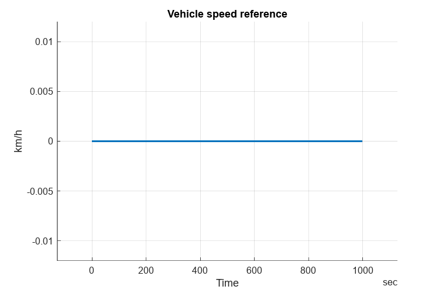

# <span style="color:rgb(213,80,0)">Vehicle Speed Reference \- Simulation Case</span>
```matlab
mdl = "VehSpdRef_harness_model";
if not(bdIsLoaded(mdl)) 
  load_system(mdl)
end
% No setup script is used with this harness model.
VehSpdRef_loadCase_Constant
```

```matlabTextOutput
Setting up simulation...
Simulation case: Constant
Setting simulation stop time to 1000 sec.
Selecting simulation case 4.
```

```matlab
simOut = sim(mdl);
simData = extractTimetable(simOut.logsout);
VehSpdRef_plotResults( SimData = simData );
```

<center></center>


*Copyright 2023\-2024 The MathWorks, Inc.*

